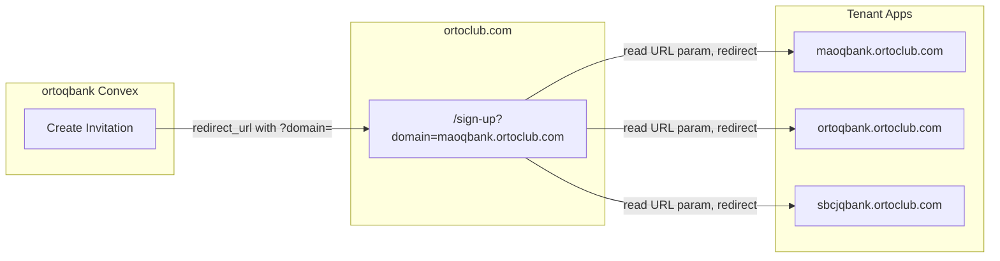
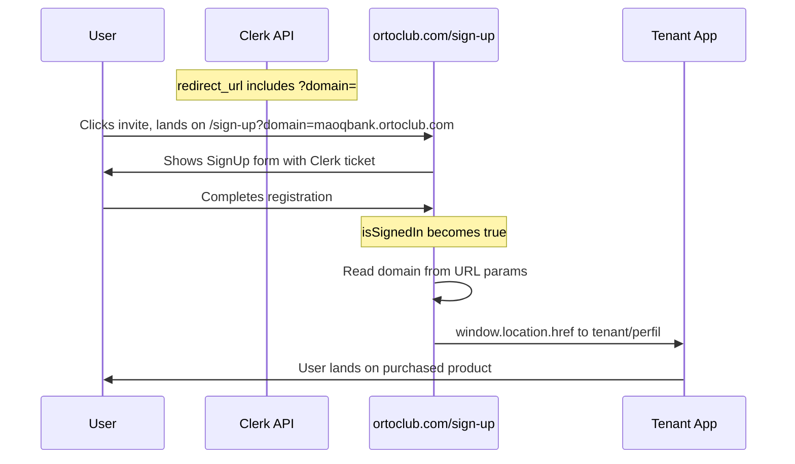

# Fix Clerk Invitation 404 - URL Params Approach

## Architecture



## Problem

- Clerk invitations redirect to tenant domain's `/sign-up` which returns 404
- Users might have multiple tenants (products) - need to redirect to the specific one they just purchased
- Don't want to store tenant data on user object

## Solution: URL Query Parameters

Pass tenant domain in the invitation's `redirect_url`. The sign-up page reads URL params and redirects after sign-up completes. No data stored on user.

### Part 1: Update Invitation Creation in ortoqbank

**File: `c:\dev\ortoqbank\convex\payments.ts` (lines 796-827)**

Change the invitation logic to include tenant domain as URL query parameter:

```typescript
// Get order to find tenantId for redirect URL
const order = await ctx.runQuery(api.payments.getPendingOrderById, {
  orderId: args.orderId,
});

// Build redirect URL with tenant info as query params
const baseUrl = process.env.AUTH_BASE_URL || "https://ortoclub.com";
let redirectUrl = `${baseUrl}/sign-up`;

if (order?.tenantId) {
  const app = await ctx.runQuery(api.apps.getAppById, {
    appId: order.tenantId,
  });
  if (app && app.domain) {
    // Pass tenant domain as URL parameter (no user metadata needed)
    redirectUrl = `${baseUrl}/sign-up?domain=${encodeURIComponent(app.domain)}`;
    console.log(`📍 Invitation redirect: ${redirectUrl}`);
  }
}

const response = await fetch("https://api.clerk.com/v1/invitations", {
  method: "POST",
  headers: {
    Authorization: `Bearer ${CLERK_SECRET_KEY}`,
    "Content-Type": "application/json",
  },
  body: JSON.stringify({
    email_address: args.email,
    redirect_url: redirectUrl,
    public_metadata: {
      orderId: args.orderId,
      customerName: args.customerName,
    },
  }),
});
```

### Part 2: Install Clerk in ortoclub

```bash
cd c:\dev\ortoclub
npm install @clerk/nextjs @clerk/localizations
```

**File: `c:\dev\ortoclub\app\providers.tsx**`

```typescript
"use client";

import { ClerkProvider } from "@clerk/nextjs";
import { ptBR } from "@clerk/localizations";
import { ConvexProvider, ConvexReactClient } from "convex/react";
import { NuqsAdapter } from "nuqs/adapters/next/app";
import { ReactNode } from "react";

const convex = new ConvexReactClient(process.env.NEXT_PUBLIC_CONVEX_URL!);

export function Providers({ children }: { children: ReactNode }) {
  return (
    <ClerkProvider
      publishableKey={process.env.NEXT_PUBLIC_CLERK_PUBLISHABLE_KEY!}
      localization={ptBR}
    >
      <NuqsAdapter>
        <ConvexProvider client={convex}>{children}</ConvexProvider>
      </NuqsAdapter>
    </ClerkProvider>
  );
}
```

### Part 3: Create Sign-Up Page in ortoclub

**File: `c:\dev\ortoclub\app\sign-up\[[...sign-up]]\page.tsx**`

```typescript
"use client";

import { SignUp, useUser } from "@clerk/nextjs";
import { useSearchParams } from "next/navigation";
import { useEffect, Suspense } from "react";

function SignUpContent() {
  const searchParams = useSearchParams();
  const { isSignedIn } = useUser();

  // Get tenant domain from URL parameter
  const domain = searchParams.get("domain");

  useEffect(() => {
    if (isSignedIn && domain) {
      // User just completed sign-up, redirect to their tenant
      window.location.href = `https://${domain}/perfil`;
    } else if (isSignedIn && !domain) {
      // Fallback if no domain specified
      window.location.href = "https://ortoqbank.ortoclub.com/perfil";
    }
  }, [isSignedIn, domain]);

  return (
    <div className="flex min-h-screen items-center justify-center bg-gradient-to-br from-gray-50 to-blue-50">
      <SignUp
        appearance={{
          elements: {
            rootBox: "mx-auto",
            card: "shadow-xl",
          },
        }}
      />
    </div>
  );
}

export default function SignUpPage() {
  return (
    <Suspense
      fallback={
        <div className="flex min-h-screen items-center justify-center">
          <div className="animate-spin h-8 w-8 border-4 border-blue-500 border-t-transparent rounded-full" />
        </div>
      }
    >
      <SignUpContent />
    </Suspense>
  );
}
```

### Part 4: Environment Variables

**ortoclub `.env.local`:**

```
NEXT_PUBLIC_CLERK_PUBLISHABLE_KEY=pk_test_c3VubnktZ2FubmV0LTk2LmNsZXJrLmFjY291bnRzLmRldiQ
NEXT_PUBLIC_CLERK_SIGN_UP_URL=/sign-up
```

**ortoqbank Convex env (for local dev):**

```
AUTH_BASE_URL=https://your-ngrok.io
```

### Part 5: Cleanup ortoqbank

Remove the sign-up/sign-in pages accidentally created:

- `c:\dev\ortoqbank\src\app\(auth)\sign-up\` - DELETE
- `c:\dev\ortoqbank\src\app\(auth)\sign-in\` - DELETE

## Flow After Implementation



## Benefits

- **No data stored on user** - Tenant info passed via URL only
- **Simple flow** - URL params preserved through sign-up
- **Multi-tenant aware** - Each purchase has its own redirect URL
- **No database lookups in callback** - Domain already in URL
